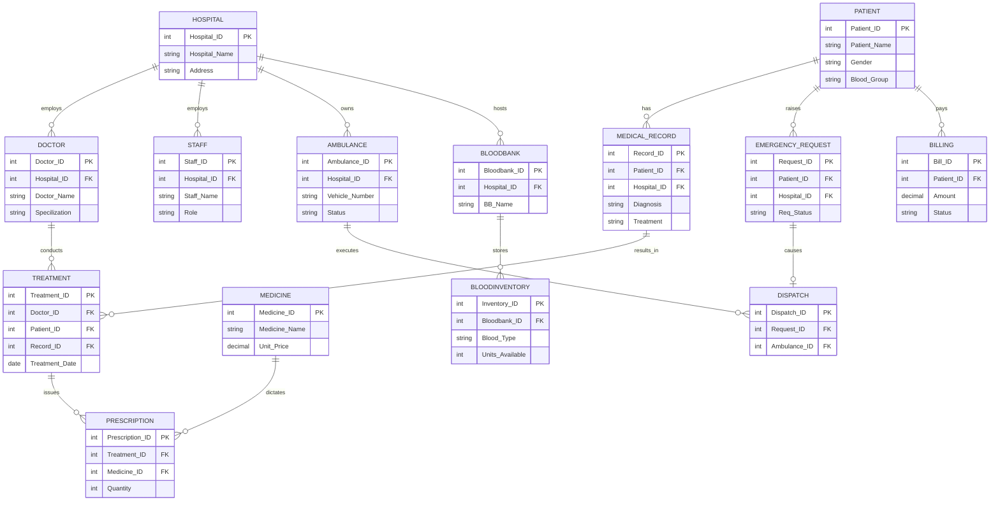

# Hospital Management System: ER Diagram

This document provides a comprehensive Entity-Relationship (ER) representation of the backend MySQL database schema! You can embed this or show this diagram directly to demonstrate your schema planning (CO4 Requirement).

